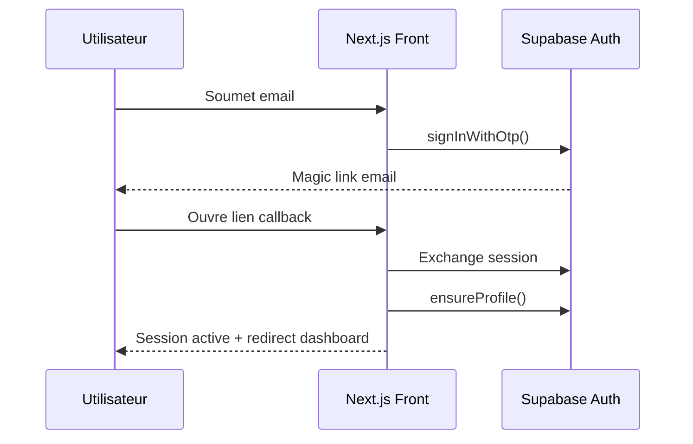
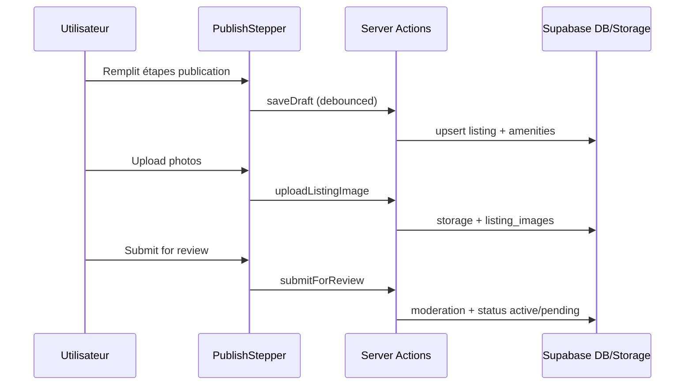
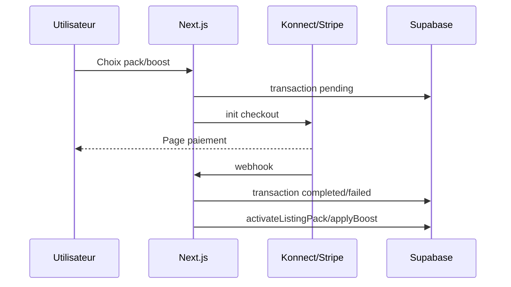
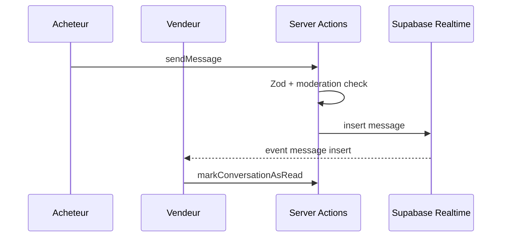

# Architecture papimo

## Vue d'ensemble

papimo est une application Next.js App Router connectée à Supabase (Auth, Postgres, Storage, Realtime), avec un back-office admin et des paiements Konnect/Stripe.

## Flow Auth (magic link)

## Flow Publication

## Flow Paiement

## Flow Messages

